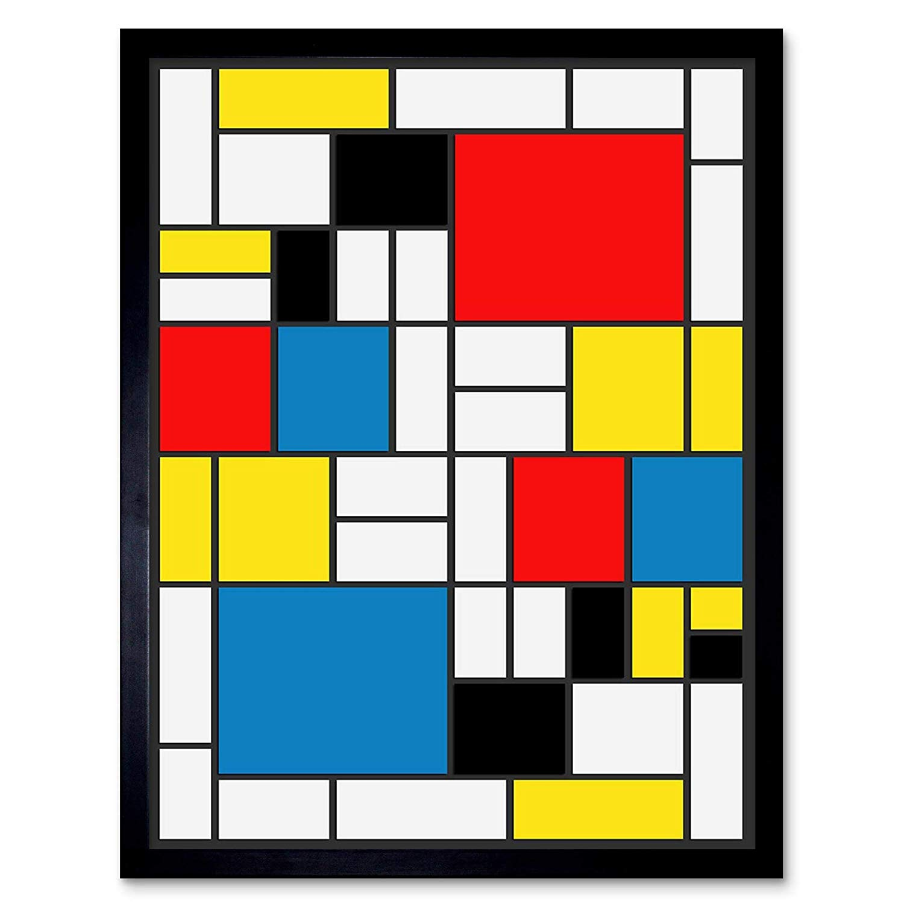

# MondrianJS
A distributed micro frontend engine which helps building application with remote elements (UI / business / logic / app. sub tree / ...etc.). `MondrianJS` is the microservices architecture but for frontend.

A good analogy would be this Mondrian painting ([Discover Piet Mondrian](https://fr.wikipedia.org/wiki/Piet_Mondrian))

  

 

Where the black outter frame is your main application that will act as a host and each colored square is a subpart of you app (UI+business) that can be either part of your main bundle or a remotely stored (not part of your core app).

`MondrianJS` has been designed for `ReactJS` application but you can also use it with other lib/frameworks.

### Is this a Server Side Rendering approach ?
In a sense, yes. Remote element can be generated on the fly / when requested by your application.

### It is like using Iframes in my UI and load remote content.
Not really. Using Iframes implies there is no shared resources between the loaded element. If 2 remotes content used lib. X,  then the library will be loaded twice. With `MonrianJS` approach dependencies, communications, styles are shared and controlled by your main application.

### So you are loaded distant code, what about security issues.
Of course you have to control what your application is executing, but since `MondrianJS` will provide all the required dependencies you have quite a good control over what you application is doing.
 
### Can I use `MondrianJS` to do module lazy loading ?
Yep, even if it has been created to distribute a `ReactJS` application, it also works for plain JS modules.

### Does it helps to reduce my bundle size ?
Sure ! but that's not the real goal of `MondrianJS`. If you want to reduce your bundle and/or reduce your application loading time, you should have a look to `code spliting`.

## Ecosystem

## Sample application

## Usage

## API
